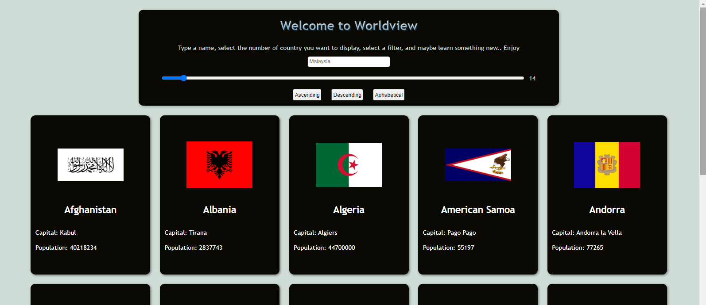

# Worldview
Unveiling Flags, Emblems, and Information about lots of countries

## Technos

## How to use it
+ Simply write a country name (or the first letters)
+ Navigate with mouse or keyboard
+ Click on the flag to show it on a map

## Additional comments
An other JS/API training. Again, improveable in many ways. But it served its purpose, with care (be kind).  